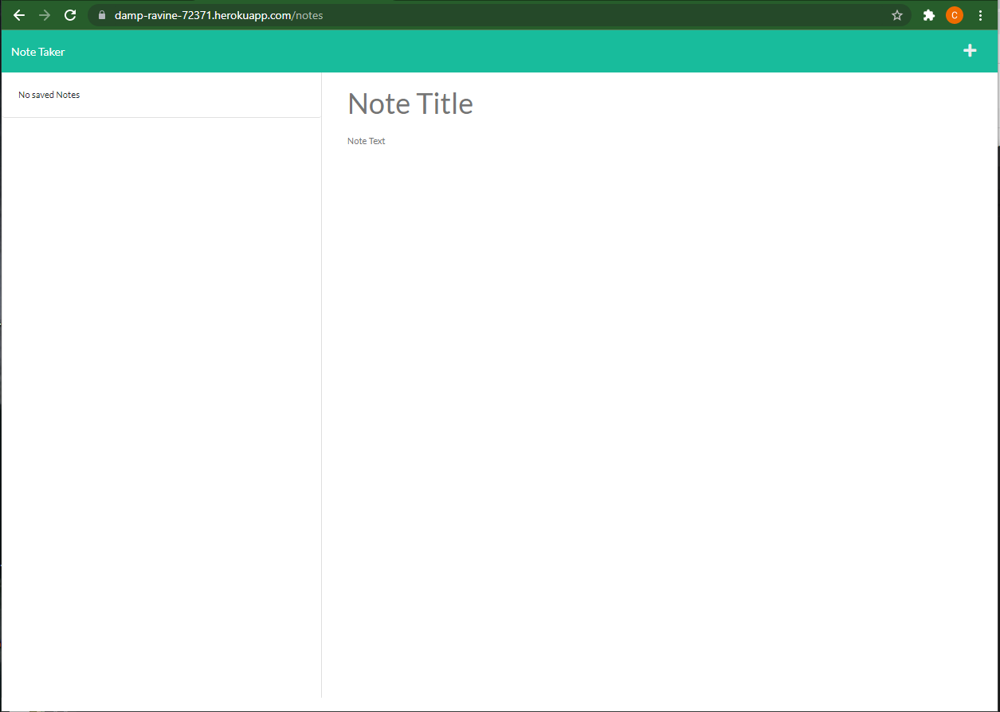
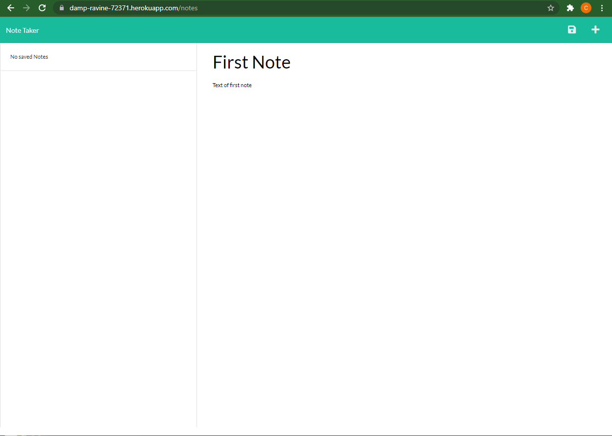
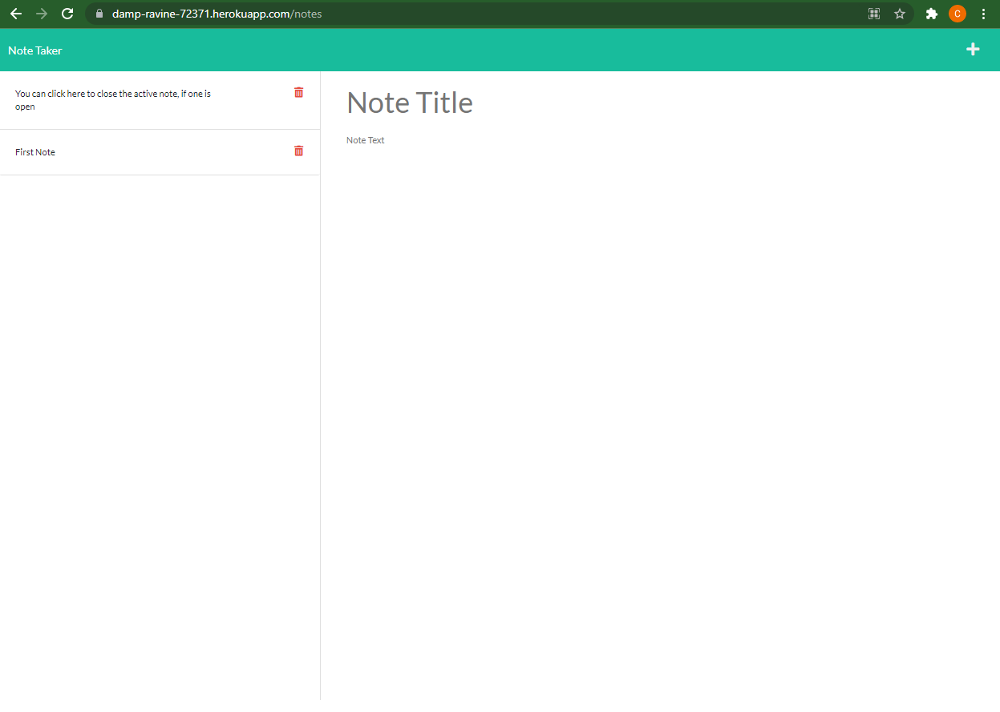
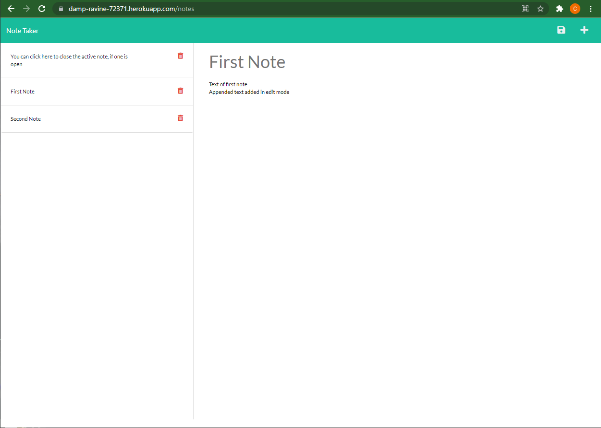

# Take-A-Note

This is an ExpressJS app that is deployable on a host server.  It is a fully-features CRUD (Create, Read, Update, Delete) application which is implemented with POST, GET, PUT, and DELETE routes.  It is deployed on Heroku at https://damp-ravine-72371.herokuapp.com.  The app lets the user create notes that are saved on the host server.  The notes can be edited and saved and deleted.

## Using the Take-A-Note application

```
A small business owner will find this app very useful to be able to write and save notes.
Because it is very light-weight, it will help to organize their thoughts and keep track of tasks to complete.
```

## Features

```
* When the user opens the app, they are presented with a landing page with a link to a notes page.
* When the user clicks on the link to the notes page, it comes up with existing notes listed in the left-hand column,
  plus empty fields to enter a new note title and the note’s text in the right-hand column.
* When the user enters a new note title and the note’s text, then a SAVE icon appears in the navigation at the top of the page
* When the user clicks on the SAVE icon, then the new note is saved and appears in the left-hand column with the other existing notes.
* When the user clicks on an existing note in the list in the left-hand column, then that note appears in the right-hand column
* While an existing note is displayed, the user can click on the EDIT icon (+ sign) in the navigation at the top right corner of the page.
* In EDIT mode, the user can edit the text of the note.  The SAVE icon appears, and the user can save the edits by clicking it.
```

## Screenshots

### The following images show the web application's appearance and functionality:


#### The first screen shows the Notes page before any notes have been written



#### This screen shows the Notes page when a note has been written, but not yet saved.  Notice that the SAVE icon appears in the upper right corner.



#### The next screen shows the Notes page after the note has been saved.  The SAVE icon is not visible.  The grayed-out placeholder text is displayed.



#### The next screen shows the Notes page in EDIT mode when the note titled "First Note" is active.  The SAVE icon is visible.  The text content of the note has been edited, and can be saved by clicking on the SAVE icon.



## Implementation

* On the back end, the application includes a `db.json` file that is used to store and retrieve notes using the `fs` module.

* The following HTML routes are implemented:
- `GET /` returns the `index.html` file.
- `GET /notes` returns the `notes.html` file.

* The following four API routes are implemented:
- `GET /api/notes` reads the `db.json` file and returns all of the saved notes as JSON.
- `POST /api/notes` receives a new note, adds it to the `db.json` file, and then returns the new note to the client.
- `PUT /api/notes` reads the `db.json` file, updates the specific note, and returns all of the saved notes as JSON.
- `DELETE /api/notes/:id` reads the `db.json` file, deletes the specific note, and returns all of the saved notes as JSON.

* `GET *` returns the `404.html` file.

## Repo:
* The code repository is at https://github.com/CChampness/Take-A-Note
## Deployment:
* The application is deployed on Heroku at https://damp-ravine-72371.herokuapp.com

